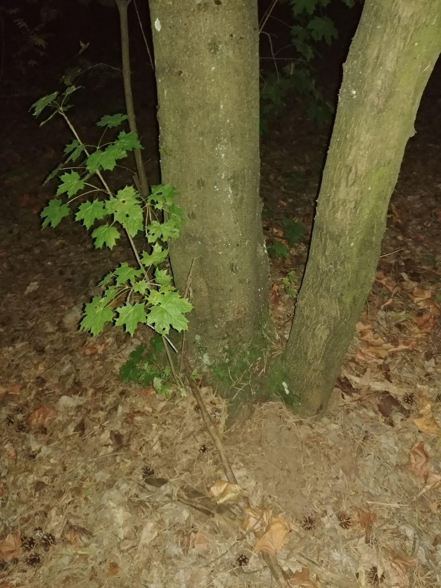

# Title $\xi_x$
## Subtitle $\xi_x$

[link](https://github.com).

$$\xi_x$$

What if my sentence ends in exclamation mark?! And the there is another sentence on the same line.

What! 
If on the other?!

!!!arrows
\node (a) {A}; \node (b) at (1,0) {B};\draw [open triangle 45-triangle 45] (a) -- (b);
!!!
